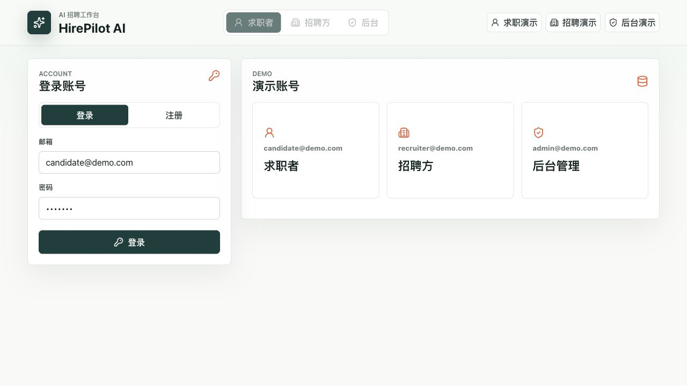
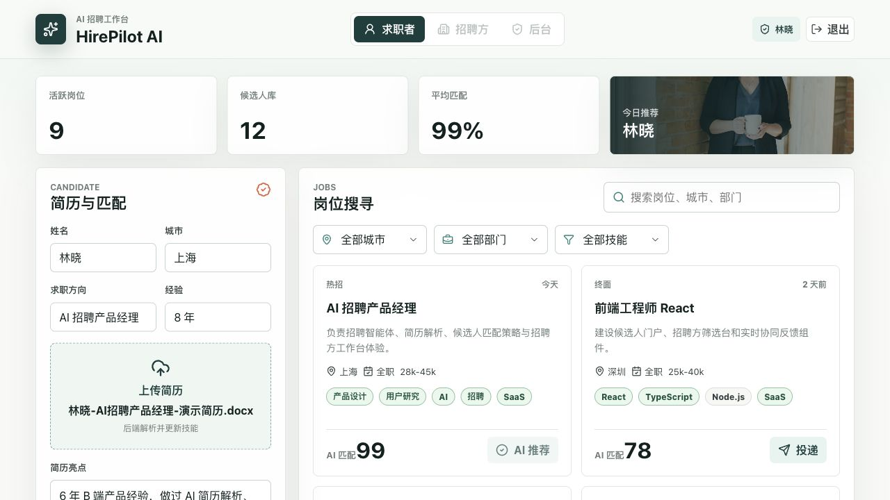
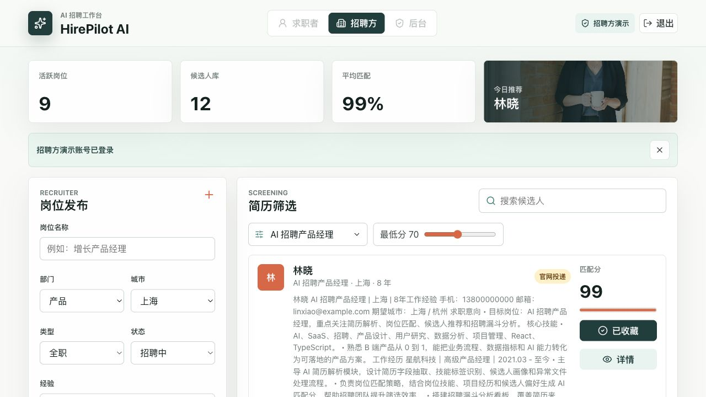
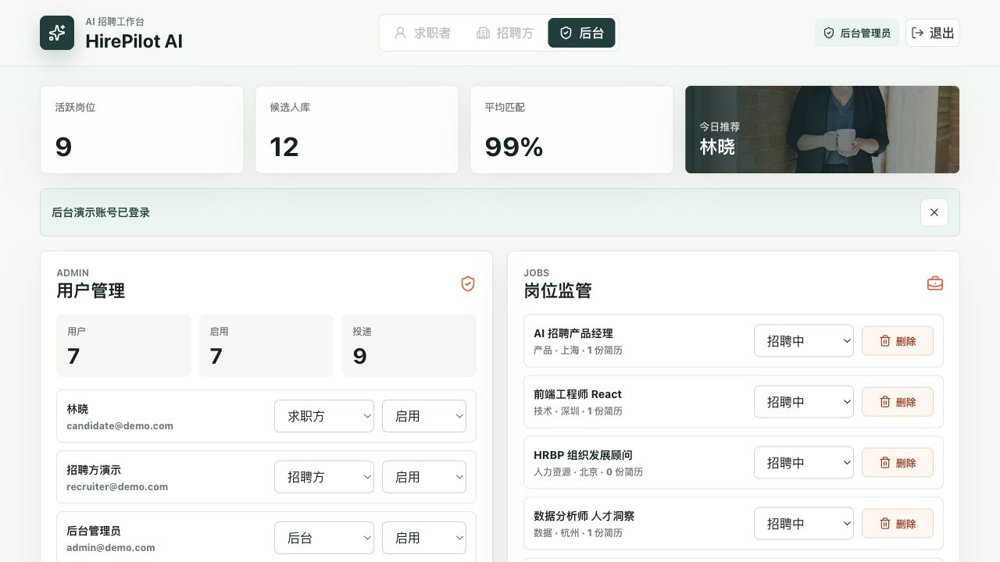

# AI 招聘网站实验报告：HirePilot AI

生成日期：2026-06-16

## 项目概述

HirePilot AI 是一个面向求职方、招聘方和后台管理方的 AI 招聘网站原型。项目以 React + TypeScript + Express 实现，围绕简历上传解析、岗位搜索筛选、岗位发布、简历筛选、角色权限和后台监管形成完整实验闭环。

## 一、实验目的

- 本实验围绕人力资源管理中的招聘效率、简历筛选和多角色协同问题，设计并实现一个 AI 招聘网站原型 HirePilot AI。

- 系统目标是让求职者、招聘方和后台管理员在同一平台内完成登录注册、简历上传解析、岗位搜索筛选、岗位发布、简历筛选、状态管理和平台监管。

- 实验重点验证：三方角色权限是否清晰，简历上传后是否能够自动解析并更新候选人信息，岗位与候选人是否能根据技能进行匹配评分，以及后台是否能完成基础管理闭环。

## 二、实验环境与技术栈

- 项目路径：/Users/vinson/Downloads/ytx。

- 前端技术：Vite、React、TypeScript、lucide-react、响应式 CSS。

- 后端技术：Express、multer 文件上传、mammoth DOCX 解析、pdf-parse PDF 解析、本地 JSON 数据持久化。

- 运行地址：前端 http://127.0.0.1:5174/，API http://127.0.0.1:4174/。

- 数据方式：首次启动后端时自动生成 server/data/db.json，保存用户、岗位、候选人和投递记录。

## 三、需求分析

- 求职者端需要支持登录注册、个人档案维护、简历上传、简历亮点自动提取、岗位搜索、城市/部门/技能筛选、AI 匹配分查看和岗位投递。

- 招聘方端需要支持岗位发布、岗位编辑、岗位暂停/开启/删除、简历筛选、按岗位查看候选人、按最低匹配分过滤候选人、候选人备注与状态流转。

- 后台管理端需要支持平台指标统计、用户管理、账号启停、角色调整、岗位监管和投递监管。

- 三方角色必须先登录后使用，且不同角色只能访问与自身身份匹配的功能模块。

## 四、系统总体设计

- 系统采用前后端分离结构。React 前端负责角色化页面、表单交互、筛选条件和状态展示；Express 后端负责认证、权限校验、简历解析、岗位管理、候选人管理和数据持久化。

- 核心数据流为：用户登录获取 token；前端携带 token 调用 API；后端通过角色权限判断操作是否允许；业务结果写入本地 JSON 数据库；前端重新拉取 bootstrap 数据刷新工作台。

- AI 能力在当前实验中采用本地规则模型模拟，主要包括简历字段解析、技能字典提取、亮点句子评分和岗位匹配分计算，便于无外部服务依赖地完成课堂/答辩演示。

## 五、核心功能实现

- 账号体系：系统提供求职者、招聘方、后台管理员三类账号。登录后根据 user.role 渲染不同工作台，后端通过 requireRole 对敏感接口进行权限限制。

- 简历上传解析：求职者上传 PDF、DOCX 或 TXT 后，后端读取简历文本，自动识别姓名、岗位、城市、经验、技能和简历亮点，并更新候选人档案。

- 岗位搜寻筛选：求职者可按关键词、城市、部门和技能筛选岗位；每个岗位显示薪资、类型、阶段、技能标签和 AI 匹配分。

- 招聘方简历筛选：招聘方根据目标岗位计算候选人匹配分，并可设置最低匹配分门槛，快速定位高匹配候选人。

- 岗位发布管理：招聘方可新建岗位、编辑岗位、暂停/开启岗位和删除岗位，系统同步刷新候选人筛选与投递数据。

- 后台管理：管理员可查看用户数、活跃用户、岗位数、开放岗位、候选人数和投递数，并对用户角色和账号状态进行管理。

## 六、实验数据设计

- 初始演示数据包含 7 个用户、10 个岗位、12 个候选人和 9 条投递记录，覆盖产品、技术、人力资源、数据、销售等招聘场景。

- 系统预置三个核心演示账号：candidate@demo.com、recruiter@demo.com、admin@demo.com，密码均为 demo123。

- 演示简历文件位于 demo-resumes/林晓-AI招聘产品经理-演示简历.docx，可用于验证上传后自动解析和亮点生成。

## 七、实验测试与结果

- 构建检查：npm run build 通过，说明 TypeScript 编译和 Vite 生产构建正常。

- 代码规范：npm run lint 通过，说明当前前端与后端代码未触发 ESLint 问题。

- 后端语法：node --check server/index.js 通过，说明后端入口文件语法正确。

- 接口健康：GET /api/health 返回 { ok: true }。

- 简历上传验证：上传演示 DOCX 后，系统成功识别林晓、AI 招聘产品经理、上海、8 年经验、核心技能和三条简历亮点。

- 页面验证：登录页、求职者端、招聘方端和后台管理端均可正常加载并完成角色切换。

## 八、实验结论

- 本实验完成了一个三方角色完整、功能闭环清晰、可本地运行演示的 AI 招聘网站原型。

- 系统能够覆盖人力资源招聘流程中的关键节点：求职者建立画像、招聘方发布岗位并筛选简历、后台进行平台级监管。

- 简历解析与亮点自动提取解决了上传后信息不更新的问题，提升了演示中的自动化效果和产品完整度。

## 九、不足与改进方向

- 当前 AI 匹配和亮点识别为规则模型，后续可接入大模型实现更强的语义理解、经历总结和岗位匹配解释。

- 当前数据存储为本地 JSON，适合实验演示；生产环境应替换为 PostgreSQL、MySQL 或 MongoDB，并加入迁移脚本。

- 当前密码使用哈希演示方案，生产环境应采用 bcrypt/argon2、盐值、会话过期和刷新机制。

- 可进一步补充文件类型校验、病毒扫描、上传大小提示、审计日志、消息通知、面试安排和招聘漏斗报表。

## 十、页面截图

### 登录注册入口



未登录状态下只展示账号登录、注册切换和三类演示账号入口。

### 求职者工作台



求职者可维护简历档案、上传简历、查看 AI 匹配分并筛选岗位。

### 招聘方工作台



招聘方可发布岗位、管理岗位状态，并按岗位与匹配分筛选候选人。

### 后台管理页



后台管理员可查看平台指标、管理用户角色与状态，并监管岗位和投递。

## 十一、核心代码

### 后端：简历基础信息解析

位置：`server/index.js:164`

从 DOCX/PDF/TXT 文本中提取姓名、目标岗位、城市、工作经验和文件名。

```ts
164  function deriveResumeProfile(text, fileName = '') {
165    const content = String(text ?? '')
166    const normalizedLines = content
167      .split(/\r?\n/)
168      .flatMap((line) => line.split(/\t| {2,}|　+/))
169      .map((line) => line.trim().replace(/\s+/g, ' '))
170      .filter(Boolean)
171    const compactText = normalizedLines.join('\n')
172    const normalizedFileName = normalizeOriginalName(fileName)
173    const cityMatch =
174      compactText.match(
175        /(?:现居地|所在地|所在城市|居住地|城市|期望城市|地址)[:：\s]*(上海|北京|深圳|杭州|广州|成都|南京|苏州|武汉|西安|远程)/,
176      ) ??
177      compactText.match(
178        /(上海|北京|深圳|杭州|广州|成都|南京|苏州|武汉|西安|远程)/,
179      )
180    const experience = firstRegexMatch(compactText, [
181      /(?:工作经验|从业经验|项目经验|年限|经验)[:：\s]*([0-9一二三四五六七八九十]+\s*年(?:以上)?)/,
182      /([0-9一二三四五六七八九十]+\s*年(?:以上)?)(?:工作|经验|从业|B 端|B端|产品|研发|运营)/,
183      /(?:拥有|具备|累计)([0-9一二三四五六七八九十]+\s*年(?:以上)?)/,
184    ])
185      .replace(/\s+/g, ' ')
186      .replace(/\s*年/g, ' 年')
187      .trim()
188    const inferredName =
189      firstRegexMatch(compactText, [
190        /(?:姓名|名字|Name)[:：\s]+([^\n\r,，;；|｜]{2,12})/i,
191        /^([一-龥]{2,4})\s*(?:\||｜|-|，|,|\s)+(?:求职|应聘|目标|岗位|方向)/,
192        /^([一-龥]{2,4})\s*(?:\||｜|-|，|,|\s)+(?:[0-9一二三四五六七八九十]+\s*年|男|女|本科|硕士|博士)/,
193      ]) ||
194      normalizedLines.find(isLikelyChineseName) ||
195      normalizedFileName
196        .replace(/\.[^.]+$/, '')
197        .match(/^([一-龥]{2,4})/)?.[1] ||
198      ''
199    const inferredTitle = cleanResumeProfileTitle(
200      firstRegexMatch(compactText, [
201        /(?:求职意向|目标岗位|应聘岗位|求职方向|意向岗位|目标职位|期望职位)[:：\s]+([^\n\r,，;；|｜]{2,32})/,
202        /(?:应聘|求职)[:：\s]*([^\n\r,，;；|｜]{2,32})/,
203      ]) || inferTitleFromLines(normalizedLines),
204    )
205  
206    return {
207      name: inferredName,
208      title: inferredTitle,
209      location: cityMatch?.[1] ?? '',
210      experience,
211      fileName: normalizedFileName,
212    }
```

### 后端：简历亮点自动识别

位置：`server/index.js:215`

按动作词、招聘业务词、效果词和技能命中进行加权评分，自动选出前三条亮点。

```ts
215  function deriveResumeHighlights(text, parsedProfile, skills) {
216    const content = String(text ?? '')
217    const lines = content
218      .split(/\r?\n|。|；|;/)
219      .map(cleanResumeLine)
220      .filter((line) => line.length >= 12 && line.length <= 90)
221    const scoredLines = lines
222      .map((line) => {
223        const score = [
224          /主导|负责|搭建|建设|优化|推动|设计|落地/.test(line) ? 3 : 0,
225          /AI|SaaS|招聘|简历|岗位|匹配|数据|分析|漏斗|候选人/.test(line) ? 3 : 0,
226          /提升|增长|转化|效率|准确率|自动化|从 0 到 1|从0到1/.test(line) ? 2 : 0,
227          skills.some((skill) => line.toLowerCase().includes(skill.toLowerCase()))
228            ? 2
229            : 0,
230        ].reduce((total, value) => total + value, 0)
231  
232        return { line, score }
233      })
234      .filter((item) => item.score > 0)
235      .sort((left, right) => right.score - left.score)
236  
237    const highlights = uniqSkills(scoredLines.slice(0, 3).map((item) => item.line))
238  
239    if (highlights.length > 0) {
240      return highlights.join('；')
241    }
242  
243    const skillText = skills.slice(0, 5).join('、') || '岗位匹配'
244    const titleText = parsedProfile.title || '目标岗位'
245    const experienceText = parsedProfile.experience
246      ? `${parsedProfile.experience}相关经验`
247      : '具备相关项目经验'
248  
249    return `${experienceText}，方向聚焦${titleText}，核心能力覆盖${skillText}。`
250  }
```

### 后端：上传简历接口

位置：`server/index.js:981`

上传接口完成文件解析、画像更新、技能合并、亮点生成和本地持久化。

```ts
 981  app.post(
 982    '/api/resumes',
 983    auth,
 984    requireRole('candidate'),
 985    upload.single('resume'),
 986    async (req, res) => {
 987      const candidate = req.db.candidates.find(
 988        (item) => item.id === req.user.candidateId,
 989      )
 990  
 991      if (!candidate || !req.file) {
 992        return res.status(400).json({ message: '请上传简历文件' })
 993      }
 994  
 995      try {
 996        const parsedText = await parseResumeFile(req.file)
 997        const highlights = String(req.body.highlights ?? '')
 998        const normalizedFileName = normalizeOriginalName(req.file.originalname)
 999        const fallbackText = parsedText || `${normalizedFileName} ${highlights}`
1000        const parsedProfile = deriveResumeProfile(
1001          `${fallbackText}\n${highlights}`,
1002          normalizedFileName,
1003        )
1004        const skills = uniqSkills([
1005          ...candidate.skills,
1006          ...extractSkills(fallbackText),
1007          ...extractSkills(highlights),
1008        ])
1009        const generatedHighlights = highlights
1010          ? ''
1011          : deriveResumeHighlights(fallbackText, parsedProfile, skills)
1012  
1013        if (parsedProfile.name) {
1014          candidate.name = parsedProfile.name
1015          req.user.name = parsedProfile.name
1016        }
1017  
1018        if (parsedProfile.title) {
1019          candidate.title = parsedProfile.title
1020        }
1021  
1022        if (parsedProfile.location) {
1023          candidate.location = parsedProfile.location
1024        }
1025  
1026        if (parsedProfile.experience) {
1027          candidate.experience = parsedProfile.experience
1028        }
1029  
1030        candidate.resume = fallbackText
1031        candidate.resumeHighlights =
1032          highlights || generatedHighlights || candidate.resumeHighlights
1033        candidate.resumeFile = parsedProfile.fileName || normalizedFileName
1034        candidate.skills = skills
1035        candidate.source = '官网投递'
1036        await writeDb(req.db)
1037  
1038        res.json({
1039          candidate,
1040          parsedLength: fallbackText.length,
1041          parser: parsedText ? 'document' : 'fallback',
1042          parsedProfile,
1043          generatedHighlights,
1044        })
```

### 前端：上传后刷新候选人档案

位置：`src/App.tsx:607`

上传成功后同步候选人档案、简历亮点和全局数据，并给出自动提取提示。

```ts
607    async function handleResumeUpload(event: ChangeEvent<HTMLInputElement>) {
608      const file = event.target.files?.[0]
609  
610      if (!file || !candidateProfile) {
611        return
612      }
613  
614      const body = new FormData()
615      body.append('resume', file)
616      body.append('highlights', resumeHighlights)
617      setIsBusy(true)
618      setMessage('')
619  
620      try {
621        const data = await request<{
622          candidate: Candidate
623          parser: string
624          parsedProfile: Partial<Candidate>
625          generatedHighlights?: string
626        }>('/api/resumes', {
627          method: 'POST',
628          body,
629        })
630  
631        setCandidateProfile(data.candidate)
632        setResumeHighlights(data.candidate.resumeHighlights ?? '')
633        await loadBootstrap()
634        await loadMe()
635        const updatedFields = [
636          data.parsedProfile.name ? '姓名' : '',
637          data.parsedProfile.title ? '求职方向' : '',
638          data.parsedProfile.location ? '城市' : '',
639          data.parsedProfile.experience ? '经验' : '',
640        ].filter(Boolean)
641        setMessage(
642          `${data.parser === 'document' ? '简历已解析' : '简历已上传'}，已更新${
643            updatedFields.join('、') || '技能'
644          }${data.generatedHighlights ? '，并自动提取简历亮点' : ''}`,
645        )
646      } catch (error) {
647        setMessage(error instanceof Error ? error.message : '上传失败')
648      } finally {
649        setIsBusy(false)
650        event.target.value = ''
651      }
```

### 前后端共用思路：AI 匹配分计算

位置：`server/index.js:252 / src/App.tsx:199`

根据岗位要求技能、候选人技能、简历文本命中和技能覆盖度计算 0-99 匹配分。

```ts
252  function scoreMatch(candidateSkills, job, resumeText = '') {
253    const requiredSkills = job.skills.length > 0 ? job.skills : ['通用能力']
254    const matchedSkills = requiredSkills.filter((skill) =>
255      candidateSkills.some(
256        (candidateSkill) =>
257          candidateSkill.toLowerCase() === skill.toLowerCase() ||
258          candidateSkill.toLowerCase().includes(skill.toLowerCase()),
259      ),
260    )
261    const skillScore = Math.round(
262      (matchedSkills.length / requiredSkills.length) * 72,
263    )
264    const textBonus = requiredSkills.reduce((total, skill) => {
265      return String(resumeText).toLowerCase().includes(skill.toLowerCase())
266        ? total + 4
267        : total
268    }, 0)
269    const coverageBonus = candidateSkills.length >= 5 ? 12 : 6
270  
271    return {
272      score: Math.min(99, skillScore + textBonus + coverageBonus),
273      matchedSkills,
274    }
275  }
```

### 后端：岗位发布与权限限制

位置：`server/index.js:1061`

仅招聘方和管理员可发布岗位，岗位技能是必填核心字段。

```ts
1061  app.post('/api/jobs', auth, requireRole(['recruiter', 'admin']), async (req, res) => {
1062    const skills = parseSkills(req.body.skills)
1063  
1064    if (!String(req.body.title ?? '').trim() || skills.length === 0) {
1065      return res.status(400).json({ message: '岗位名称和核心技能必填' })
1066    }
1067  
1068    const job = {
1069      id: id('job'),
1070      title: String(req.body.title).trim(),
1071      department: String(req.body.department ?? '产品'),
1072      location: String(req.body.location ?? '上海'),
1073      type: String(req.body.type ?? '全职'),
1074      level: String(req.body.level ?? '3-5 年'),
1075      salary: String(req.body.salary ?? '').trim() || '面议',
1076      owner: req.user.name,
1077      summary:
1078        String(req.body.summary ?? '').trim() ||
1079        '新岗位已发布，AI 会按岗位技能自动生成候选人匹配分。',
1080      skills,
1081      posted: '刚刚',
1082      stage: '新发布',
1083      status: 'open',
1084      createdAt: nowLabel(),
1085    }
1086  
1087    req.db.jobs.unshift(job)
1088    await writeDb(req.db)
1089  
1090    res.status(201).json({
1091      job: {
1092        ...job,
1093        applicants: 0,
1094      },
1095    })
1096  })
```

### 后端：后台数据总览

位置：`server/index.js:1282`

管理员统一获取用户、岗位、候选人、投递记录和平台指标。

```ts
1282  app.get('/api/admin/overview', auth, requireRole('admin'), (req, res) => {
1283    const jobs = withApplicantCounts(req.db.jobs, req.db.applications)
1284  
1285    res.json({
1286      users: req.db.users.map(publicUser),
1287      jobs,
1288      candidates: req.db.candidates,
1289      applications: req.db.applications,
1290      metrics: {
1291        users: req.db.users.length,
1292        activeUsers: req.db.users.filter((user) => user.status !== 'disabled')
1293          .length,
1294        jobs: req.db.jobs.length,
1295        openJobs: req.db.jobs.filter((job) => job.status === 'open').length,
1296        candidates: req.db.candidates.length,
1297        applications: req.db.applications.length,
1298      },
1299    })
```

## 十二、PPT 素材拆解

- **1. 课题背景**：招聘流程中简历筛选耗时、岗位匹配依赖人工经验、三方协作信息分散。

- **2. 实验目标**：设计 AI 招聘网站，实现求职方、招聘方、后台管理三方闭环。

- **3. 技术架构**：React + TypeScript + Express + 本地 JSON，前后端分离。

- **4. 角色与权限**：先登录注册再使用，按 candidate/recruiter/admin 渲染功能和限制接口。

- **5. 求职者端**：简历上传解析、自动更新档案、岗位搜索筛选、AI 匹配分、投递记录。

- **6. 招聘方端**：岗位发布编辑、候选人筛选、匹配分过滤、备注和状态流转。

- **7. 后台管理**：用户管理、角色调整、账号启停、岗位监管、投递监管、平台指标。

- **8. 核心算法**：技能字典提取、简历字段解析、亮点句子评分、岗位匹配分计算。

- **9. 测试结果**：构建、lint、语法、健康接口、页面登录、简历上传均通过验证。

- **10. 总结展望**：原型完成招聘管理闭环，后续可接入真实大模型与数据库增强生产能力。
